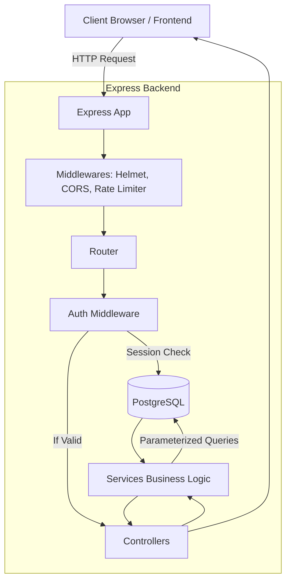

# Secure Auth Platform

## Quick Start

The repository contains two clearly separated implementations:

- `custom-backend/`: Node.js/Express REST API with PostgreSQL and database-backed sessions.
- `appwrite/`: Appwrite setup and seed scripts plus the Appwrite web adapter.

### Shortcut: `./start.sh`

For the custom backend, the shortest path from a fresh checkout is:

```bash
chmod +x start.sh   # only needed once
./start.sh
```

The script checks for Docker, Node/npm, and Python 3; starts PostgreSQL with Docker Compose; runs the custom migration and seed commands; starts the API on `http://localhost:3000`; and serves the test client on `http://localhost:5500`. Press `Ctrl+C` to stop the API and frontend. The PostgreSQL volume remains available for later runs.

### Manual Custom Backend Setup

Prerequisites: Docker with Compose, Node.js 18+, npm, and Python 3.

```bash
cp custom-backend/.env.example custom-backend/.env
cd custom-backend
npm install
cd ..
docker compose up -d
cd custom-backend
npm run setup                 # migrate schema and seed 3 users plus 6 files
npm run dev                  # API at http://localhost:3000
```

In a second terminal, serve the test client:

```bash
cd /path/to/osdag
python3 -m http.server 5500
```

Open `http://localhost:5500`. To stop PostgreSQL later, run `docker compose down` from the repository root. The custom seed is repeatable and clears/recreates the development users and files; do not run it against production data.

### Appwrite Setup

Appwrite is a separately configured cloud implementation and is not started by `./start.sh`.

1. Create an Appwrite project and a server API key with the scopes required by the setup scripts.
2. Configure its environment:

  ```bash
  cp appwrite/.env.example appwrite/.env
  # Edit appwrite/.env with the endpoint, project ID, API key, database, collection, and bucket IDs.
  ```

3. Install and initialize Appwrite resources:

  ```bash
  cd appwrite
  npm install
  npm run setup
  npm run seed
  ```

4. Serve the root test client (`python3 -m http.server 5500`), enable the Appwrite SDK and `appwrite/web/appwrite-adapter.js` script tags in `index.html`, select **Appwrite**, and enter the configured resource IDs. Never expose `APPWRITE_API_KEY` in browser code.

### Seeded Test Users and Files

Both implementations use these development credentials:

| Email | Password | Seeded files |
|---|---|---|
| `alice@example.com` | `Password123!` | `resume_alice.pdf`, `profile_photo.jpg` |
| `bob@example.com` | `Password123!` | `project_notes.txt`, `invoice_march.pdf` |
| `carol@example.com` | `Password123!` | `test_plan.docx`, `vacation.png` |

The custom seed writes the six sample files to `custom-backend/uploads/` and inserts their metadata into PostgreSQL. Run `cd custom-backend && npm run seed` after the database is available. The Appwrite seed creates the same three accounts, uploads sample files to the configured bucket, and creates their metadata documents; run `cd appwrite && npm run seed` after `npm run setup`. The test client has quick-fill buttons for all three users.

## Authentication and Authorization Decisions

### Why Sessions Instead of JWTs?

The custom implementation uses opaque, database-backed sessions rather than JWTs. A session can be revoked immediately by changing one database row, which gives logout and account compromise response strong semantics. The session ID is random, stored only as a SHA-256 hash in PostgreSQL, and sent to the browser in an `HttpOnly`, `SameSite=Lax` cookie. JWTs are useful for independently verifiable, distributed services, but a stolen JWT normally remains valid until expiry; immediate revocation requires a blocklist or short-lived-token and refresh-token design.

### Logout Under the Hood

Custom logout hashes the session cookie value, updates the matching `sessions` row with `revoked_at = NOW()`, and clears the cookie. Subsequent protected requests fail session validation even if an old cookie was copied. Appwrite logout calls `deleteSession('current')`, which revokes the current Appwrite session, and the adapter clears its client-side session state.

### User Data Isolation

The custom backend derives the authenticated user ID only from the validated session. Protected file queries include the owner predicate (`user_id = authenticated user ID`) in the SQL query, and stored file paths are resolved only after that ownership check. This prevents a caller from changing a file ID to access another user's file. Appwrite uses `documentSecurity: true`, no broad collection permissions, and per-document and per-storage-file permissions for `Role.user(ownerId)`; Appwrite enforces those checks server-side rather than relying on frontend filtering.

### Appwrite: Automatic vs Configured

Appwrite automatically provides password hashing, account creation, session cookies, session deletion, email uniqueness, and platform rate limiting. This repository configures the database, file metadata collection and attributes, owner index, storage bucket, file size/type limits, document security, file security, per-user permissions, and adapter mapping. The full Appwrite details are also documented in [appwrite/README.md](appwrite/README.md).

## Improvements Given More Time

I would add email verification and password reset flows, CSRF tokens for deployments requiring cross-site cookie use, real upload validation and object storage lifecycle handling, Redis-backed session/rate-limit storage for multiple API instances, structured end-to-end tests for both implementations, and a production deployment guide with HTTPS and secret management. I would also make the Appwrite browser integration a separate bundled client instead of requiring manual script-tag changes in the test page.

## 1. Project Overview
**What the project is:** A complete, highly secure authentication platform and file-sharing API. It implements user registration, login, profile management, and protected file access.
**What problem it solves:** It provides a robust, production-ready solution to common security vulnerabilities like Session Hijacking, Cross-Site Scripting (XSS), Cross-Site Request Forgery (CSRF), and Insecure Direct Object References (IDOR).
**Why I built it:** To demonstrate a deep understanding of web security, server-side session management, and backend architecture using Node.js and PostgreSQL.
**Real-world use cases:** Can serve as the foundational authentication and authorization layer for SaaS applications, internal company portals, or confidential document-sharing platforms.

---

## 2. Problem Statement
**What was difficult before this project:** Implementing authentication securely is notoriously difficult. Storing tokens in `localStorage` leaves users vulnerable to XSS. Using stateless JWTs makes it impossible to instantly revoke a compromised user session. Relying solely on client-side logic can easily lead to data leaks via IDOR.
**How my project solves it:** 
- Uses **Server-Side Sessions** mapped to a PostgreSQL database, allowing instant server-side revocation (true logout).
- Uses **HttpOnly, SameSite cookies** to store session identifiers, completely neutralizing XSS token theft.
- Implements strict **SQL-level ownership checks** to prevent IDOR on file access.
**What makes the solution useful:** It provides a template that prioritizes security over convenience without sacrificing performance, meeting enterprise-grade security requirements.

---

## 3. Key Features
- **Secure User Registration:** Passwords are mathematically hashed using `bcrypt` (cost factor 12) before ever touching the database.
- **Server-Side Session Management:** Cryptographically secure random session IDs are generated, hashed via SHA-256, and stored in PostgreSQL.
- **True Logout Mechanism:** When a user logs out, their session is explicitly marked as `revoked_at = NOW()` in the database. The session instantly becomes useless even if the cookie is intercepted.
- **Strict Data Isolation (IDOR Protection):** Users can only access files they explicitly own. Every database query enforces `user_id = req.user.id`.
- **Advanced Rate Limiting:** Global IP-based rate limiting prevents DDoS, and account-based rate limiting (5 attempts before lockout) prevents brute-force password guessing.
- **Security Headers & CORS:** Configured with `helmet` for HTTP headers and strict CORS origin/credentials enforcement.

---

## 4. Technology Stack
- **Frontend:** HTML5, Vanilla JavaScript (Mock client provided for testing the API).
- **Backend:** Node.js, Express.js. Chosen for their non-blocking I/O and vast ecosystem.
- **Database:** PostgreSQL. Chosen because authentication and user-file relationships are strictly relational. It guarantees ACID compliance.
- **Libraries/Frameworks:**
  - `bcrypt`: Industry standard for secure password hashing.
  - `express-rate-limit`: For IP-level brute force protection.
  - `helmet`: Automatically sets secure HTTP headers.
  - `cors` & `cookie-parser`: To securely handle cross-origin requests and HttpOnly cookies.
  - `pg`: Native PostgreSQL client to execute parameterized queries.
  - `jest` & `supertest`: For robust API and security testing.
- **Deployment:** Docker (via Docker Compose) to seamlessly run the PostgreSQL instance across environments. Python `http.server` for the static frontend.

---

## 5. System Architecture
**Architecture Flow:**
1. **Client** makes an HTTP request to the Express API.
2. The request passes through **Helmet (Headers), CORS, Cookie Parser**, and **Rate Limiter**.
3. It hits the **Route Layer** which routes to a specific endpoint (e.g., `/files/:id`).
4. If protected, the **Auth Middleware** extracts the session cookie, queries the PostgreSQL DB, and validates the session. If valid, it attaches the `req.user`.
5. The **Controller** receives the request, validates the URL parameters, and calls the **Service Layer**.
6. The **Service Layer** executes business logic and queries **PostgreSQL** using parameterized SQL.
7. The DB responds, the Service returns data to the Controller, and the Controller sends an HTTP response to the Client.



---

## 6. How I Implemented It (Step-by-Step)
1. **Project Setup & Docker:** Set up `package.json` and created a `docker-compose.yml` to spin up a local PostgreSQL container (`secure_auth_db`).
2. **Database Design:** Created `schema.sql` defining `users`, `sessions`, `files`, and `login_attempts` tables with Foreign Key constraints and Indexes. Wrote a `migrate.js` script to auto-apply schemas.
3. **Backend Structure:** Adopted an MVC-like 3-layer architecture: `Routes` -> `Controllers` (request handling) -> `Services` (business logic/DB queries).
4. **Middleware Implementation:** Configured `app.js` with `helmet`, `cors`, and global error handling. Built custom `auth.middleware.js` to parse cookies and validate sessions against the DB.
5. **Authentication Flow:** Built registration (hashing passwords) and login (creating sessions). Stored session IDs securely in cookies.
6. **Data Access (IDOR Prevention):** Implemented the `file.service.js` which strictly appends `AND user_id = $2` to SQL queries when fetching files.
7. **Rate Limiting & Security:** Implemented IP-based and Account-based rate limiting to prevent brute-force login attempts.
8. **Testing:** Wrote Jest/Supertest integration tests to verify successful flows and edge cases (e.g., attempting to download someone else's file).

---

## 7. Important Code/Logic
**1. True Server-Side Logout (Session Revocation)**
*What it does:* Immediately invalidates a user's session.
*How it works:* Instead of just clearing the cookie on the client (which a hacker could have copied), the backend executes: `UPDATE sessions SET revoked_at = NOW() WHERE token_hash = $1`.
*Why it’s better:* If we used stateless JWTs, a stolen JWT remains valid until it expires. By checking the database on every request, we can lock a compromised account *instantly*.

**2. Anti-IDOR Database Query**
*What it does:* Prevents User A from reading User B's files by modifying the ID in the URL (`/files/2`).
*How it works:* 
```javascript
// Inside file.service.js
const result = await pool.query(
  'SELECT * FROM files WHERE id = $1 AND user_id = $2', 
  [fileId, req.user.id] // req.user.id is securely derived from the session!
);
```
*Why it’s better:* We don't fetch the file and then check ownership in code (which is prone to logic errors). We enforce ownership at the database level.

---

## 8. Data Flow Example (User Accessing a Protected File)
1. **User Action:** Clicks "Download File" on the UI.
2. **Frontend:** Sends a `GET /files/:id/download` request to the backend. The browser automatically attaches the `HttpOnly` session cookie.
3. **Auth Middleware:** Reads the cookie, hashes the session ID, checks the `sessions` table in PostgreSQL. Ensures `revoked_at` is NULL and `expires_at` is in the future. Attaches the verified user ID to `req.user`.
4. **API Route/Controller:** The request reaches the File Controller, which grabs the file ID from the URL (`req.params.id`) and passes it to the File Service.
5. **Service/Database:** The Service queries `SELECT * FROM files WHERE id = $1 AND user_id = $2`. 
6. **Response:** If a row is returned, the controller sends the file metadata/content via a `200 OK`. If no row is returned, the controller checks if the file exists at all. If it does, it returns `403 Forbidden` (wrong owner), otherwise `404 Not Found`.

---

## 9. Design Decisions
- **Why PostgreSQL?** The relationships between Users, Sessions, and Files are highly structured. Relational constraints (Foreign Keys) maintain data integrity if a user is deleted (cascading deletes for sessions and files).
- **Why Server-Side Sessions over JWT?** Security. The core requirement was absolute control over sessions (instant revocation upon logout or password change). JWTs are stateless and cannot be revoked without a complex blocklist mechanism.
- **Why MVC (Routes-Controllers-Services)?** Separation of concerns. Controllers only handle HTTP (req/res). Services only handle business logic and DB queries. This makes unit testing services extremely easy without mocking HTTP objects.
- **Why HttpOnly Cookies?** To completely mitigate Cross-Site Scripting (XSS). If a token is in `localStorage`, malicious JS can read it. `HttpOnly` cookies are invisible to JavaScript.

---

## 10. Challenges & Solutions
1. **Challenge:** Handling CORS issues when the frontend and backend run on different ports.
   **Solution:** Configured the `cors` middleware explicitly allowing the frontend origin (`http://localhost:5500`) and setting `credentials: true`. This was required for the browser to send cookies cross-origin.
2. **Challenge:** Preventing brute-force attacks against user accounts.
   **Solution:** Implemented a two-tier rate limiting system. A global IP rate limiter (`express-rate-limit`) prevents DDoS, and a custom DB-backed Account limiter locks an email address for 5 minutes after 5 consecutive failed logins.
3. **Challenge:** Protecting session tokens in the database.
   **Solution:** Even if the database is leaked, raw session IDs shouldn't be exposed. I hashed the session IDs with SHA-256 before storing them in the DB. The client holds the raw ID in the cookie. 

---

## 11. Security Checklist
- **Authentication:** `bcrypt` for password hashing. Cryptographically secure random strings for session IDs.
- **Authorization (IDOR prevention):** Strict SQL-level `user_id` filtering for all protected resources.
- **Input Validation:** Parsed and validated request bodies. Handled unhandled exceptions gracefully.
- **XSS Protection:** `HttpOnly` session cookies.
- **CSRF Protection:** `SameSite=Lax` cookie attribute.
- **SQL Injection Prevention:** Used `pg` parameterized queries (`$1, $2`) exclusively. String concatenation is never used in SQL.
- **Environment Variables:** Secrets (DB credentials, Ports) loaded via `.env` and never committed to source control.

---

## 12. Performance & Optimization
- **What could become slow:** Querying the `sessions` table on every protected request.
- **How it's handled:** Created database indexes on `token_hash` in the `sessions` table, and `email` in the `users` table to ensure `O(log N)` lookup times.
- **Future optimization:** If read loads increase, session validation could be moved to an in-memory datastore like Redis to bypass PostgreSQL for auth checks.

---

## 13. Testing
- **Integration Testing:** Used `Jest` and `Supertest` to write API tests.
- **Security Testing:** Specifically wrote tests to attempt IDOR (User A fetching User B's file), which correctly asserted `403 Forbidden` responses.
- **Manual Testing:** Used the provided `index.html` UI to manually verify cookie storage, login state persistence, and logout flow.

---

## 14. Deployment
To run this locally for development or demonstration:
1. Ensure Docker and Node 18+ are installed.
2. Inside `custom-backend`, run `npm install`.
3. Start the PostgreSQL database: `docker compose up -d`.
4. Run DB migrations and seeding: `cd custom-backend && npm run setup`.
5. Start the frontend and backend simultaneously using the provided script: `./start.sh` (from the project root).
6. Visit `http://localhost:5500` in the browser.

---

## 15. Project Folder Structure
```text
secure-auth-platform/
├── docker-compose.yml         # Postgres Database container setup
├── start.sh                   # Script to run API and UI concurrently
├── custom-backend/            # Node.js API Codebase
│   ├── package.json           # Dependencies and scripts
│   ├── src/
│   │   ├── app.js             # Express app & middleware setup
│   │   ├── config/            # Env variables and DB connection pool
│   │   ├── controllers/       # HTTP Req/Res handlers (auth, file, user)
│   │   ├── middleware/        # Auth validation, Error handling, Rate limiting
│   │   ├── routes/            # Express route mapping
│   │   ├── services/          # Core business logic and SQL queries
│   │   └── utils/             # Loggers, formatters
│   ├── db/
│   │   ├── schema.sql         # Table definitions (users, sessions, files)
│   │   └── migrate.js         # Script to create tables
│   └── tests/                 # Jest integration tests
└── web/                       # Frontend test client
    └── index.html             # UI to interact with the API
```

---

## 16. What I Learned
- The fundamental differences between stateful (Session) and stateless (JWT) authentication, and when to use each.
- How to write raw SQL queries safely using parameterization to prevent SQL injection.
- How CORS actually works under the hood, particularly regarding the `credentials` flag and cross-origin cookies.
- Architectural patterns like separating Routes, Controllers, and Services to make a codebase testable and maintainable.

---

## 17. Future Improvements
- **Redis Integration:** Caching session data in Redis for faster, scalable auth checks.
- **File Upload Service:** Implementing `multer` to allow users to actually upload files to an S3 bucket instead of using seeded data.
- **Refresh Tokens:** If moving to a mobile app, implementing a short-lived access token / long-lived refresh token architecture.
- **OAuth Integration:** Adding "Login with Google/GitHub" functionality.

---
