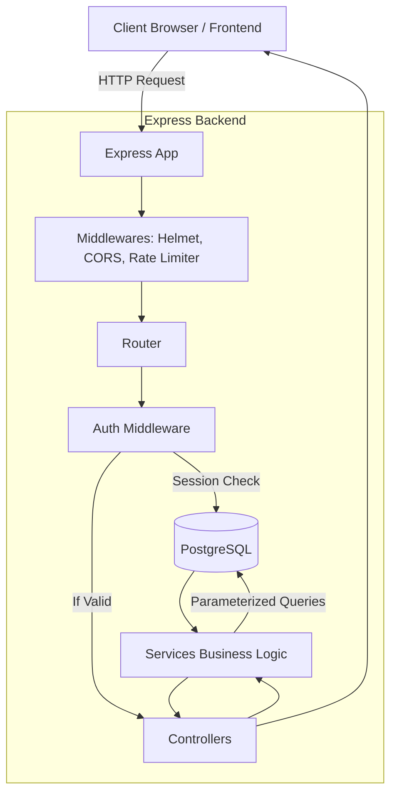

# Secure Auth Platform

## 1. Project Overview
**What the project is:** A complete, highly secure authentication platform and file-sharing API. It implements user registration, login, profile management, and protected file access.
**What problem it solves:** It provides a robust, production-ready solution to common security vulnerabilities like Session Hijacking, Cross-Site Scripting (XSS), Cross-Site Request Forgery (CSRF), and Insecure Direct Object References (IDOR).
**Why I built it:** To demonstrate a deep understanding of web security, server-side session management, and backend architecture using Node.js and PostgreSQL.
**Real-world use cases:** Can serve as the foundational authentication and authorization layer for SaaS applications, internal company portals, or confidential document-sharing platforms.

---

## 2. Problem Statement
**What was difficult before this project:** Implementing authentication securely is notoriously difficult. Storing tokens in `localStorage` leaves users vulnerable to XSS. Using stateless JWTs makes it impossible to instantly revoke a compromised user session. Relying solely on client-side logic can easily lead to data leaks via IDOR.
**How my project solves it:** 
- Uses **Server-Side Sessions** mapped to a PostgreSQL database, allowing instant server-side revocation (true logout).
- Uses **HttpOnly, SameSite cookies** to store session identifiers, completely neutralizing XSS token theft.
- Implements strict **SQL-level ownership checks** to prevent IDOR on file access.
**What makes the solution useful:** It provides a template that prioritizes security over convenience without sacrificing performance, meeting enterprise-grade security requirements.

---

## 3. Key Features
- **Secure User Registration:** Passwords are mathematically hashed using `bcrypt` (cost factor 12) before ever touching the database.
- **Server-Side Session Management:** Cryptographically secure random session IDs are generated, hashed via SHA-256, and stored in PostgreSQL.
- **True Logout Mechanism:** When a user logs out, their session is explicitly marked as `revoked_at = NOW()` in the database. The session instantly becomes useless even if the cookie is intercepted.
- **Strict Data Isolation (IDOR Protection):** Users can only access files they explicitly own. Every database query enforces `user_id = req.user.id`.
- **Advanced Rate Limiting:** Global IP-based rate limiting prevents DDoS, and account-based rate limiting (5 attempts before lockout) prevents brute-force password guessing.
- **Security Headers & CORS:** Configured with `helmet` for HTTP headers and strict CORS origin/credentials enforcement.

---

## 4. Technology Stack
- **Frontend:** HTML5, Vanilla JavaScript (Mock client provided for testing the API).
- **Backend:** Node.js, Express.js. Chosen for their non-blocking I/O and vast ecosystem.
- **Database:** PostgreSQL. Chosen because authentication and user-file relationships are strictly relational. It guarantees ACID compliance.
- **Libraries/Frameworks:**
  - `bcrypt`: Industry standard for secure password hashing.
  - `express-rate-limit`: For IP-level brute force protection.
  - `helmet`: Automatically sets secure HTTP headers.
  - `cors` & `cookie-parser`: To securely handle cross-origin requests and HttpOnly cookies.
  - `pg`: Native PostgreSQL client to execute parameterized queries.
  - `jest` & `supertest`: For robust API and security testing.
- **Deployment:** Docker (via Docker Compose) to seamlessly run the PostgreSQL instance across environments. Python `http.server` for the static frontend.

---

## 5. System Architecture
**Architecture Flow:**
1. **Client** makes an HTTP request to the Express API.
2. The request passes through **Helmet (Headers), CORS, Cookie Parser**, and **Rate Limiter**.
3. It hits the **Route Layer** which routes to a specific endpoint (e.g., `/files/:id`).
4. If protected, the **Auth Middleware** extracts the session cookie, queries the PostgreSQL DB, and validates the session. If valid, it attaches the `req.user`.
5. The **Controller** receives the request, validates the URL parameters, and calls the **Service Layer**.
6. The **Service Layer** executes business logic and queries **PostgreSQL** using parameterized SQL.
7. The DB responds, the Service returns data to the Controller, and the Controller sends an HTTP response to the Client.



---

## 6. How I Implemented It (Step-by-Step)
1. **Project Setup & Docker:** Set up `package.json` and created a `docker-compose.yml` to spin up a local PostgreSQL container (`secure_auth_db`).
2. **Database Design:** Created `schema.sql` defining `users`, `sessions`, `files`, and `login_attempts` tables with Foreign Key constraints and Indexes. Wrote a `migrate.js` script to auto-apply schemas.
3. **Backend Structure:** Adopted an MVC-like 3-layer architecture: `Routes` -> `Controllers` (request handling) -> `Services` (business logic/DB queries).
4. **Middleware Implementation:** Configured `app.js` with `helmet`, `cors`, and global error handling. Built custom `auth.middleware.js` to parse cookies and validate sessions against the DB.
5. **Authentication Flow:** Built registration (hashing passwords) and login (creating sessions). Stored session IDs securely in cookies.
6. **Data Access (IDOR Prevention):** Implemented the `file.service.js` which strictly appends `AND user_id = $2` to SQL queries when fetching files.
7. **Rate Limiting & Security:** Implemented IP-based and Account-based rate limiting to prevent brute-force login attempts.
8. **Testing:** Wrote Jest/Supertest integration tests to verify successful flows and edge cases (e.g., attempting to download someone else's file).

---

## 7. Important Code/Logic
**1. True Server-Side Logout (Session Revocation)**
*What it does:* Immediately invalidates a user's session.
*How it works:* Instead of just clearing the cookie on the client (which a hacker could have copied), the backend executes: `UPDATE sessions SET revoked_at = NOW() WHERE token_hash = $1`.
*Why it’s better:* If we used stateless JWTs, a stolen JWT remains valid until it expires. By checking the database on every request, we can lock a compromised account *instantly*.

**2. Anti-IDOR Database Query**
*What it does:* Prevents User A from reading User B's files by modifying the ID in the URL (`/files/2`).
*How it works:* 
```javascript
// Inside file.service.js
const result = await pool.query(
  'SELECT * FROM files WHERE id = $1 AND user_id = $2', 
  [fileId, req.user.id] // req.user.id is securely derived from the session!
);
```
*Why it’s better:* We don't fetch the file and then check ownership in code (which is prone to logic errors). We enforce ownership at the database level.

---

## 8. Data Flow Example (User Accessing a Protected File)
1. **User Action:** Clicks "Download File" on the UI.
2. **Frontend:** Sends a `GET /files/:id/download` request to the backend. The browser automatically attaches the `HttpOnly` session cookie.
3. **Auth Middleware:** Reads the cookie, hashes the session ID, checks the `sessions` table in PostgreSQL. Ensures `revoked_at` is NULL and `expires_at` is in the future. Attaches the verified user ID to `req.user`.
4. **API Route/Controller:** The request reaches the File Controller, which grabs the file ID from the URL (`req.params.id`) and passes it to the File Service.
5. **Service/Database:** The Service queries `SELECT * FROM files WHERE id = $1 AND user_id = $2`. 
6. **Response:** If a row is returned, the controller sends the file metadata/content via a `200 OK`. If no row is returned, the controller checks if the file exists at all. If it does, it returns `403 Forbidden` (wrong owner), otherwise `404 Not Found`.

---

## 9. Design Decisions
- **Why PostgreSQL?** The relationships between Users, Sessions, and Files are highly structured. Relational constraints (Foreign Keys) maintain data integrity if a user is deleted (cascading deletes for sessions and files).
- **Why Server-Side Sessions over JWT?** Security. The core requirement was absolute control over sessions (instant revocation upon logout or password change). JWTs are stateless and cannot be revoked without a complex blocklist mechanism.
- **Why MVC (Routes-Controllers-Services)?** Separation of concerns. Controllers only handle HTTP (req/res). Services only handle business logic and DB queries. This makes unit testing services extremely easy without mocking HTTP objects.
- **Why HttpOnly Cookies?** To completely mitigate Cross-Site Scripting (XSS). If a token is in `localStorage`, malicious JS can read it. `HttpOnly` cookies are invisible to JavaScript.

---

## 10. Challenges & Solutions
1. **Challenge:** Handling CORS issues when the frontend and backend run on different ports.
   **Solution:** Configured the `cors` middleware explicitly allowing the frontend origin (`http://localhost:5500`) and setting `credentials: true`. This was required for the browser to send cookies cross-origin.
2. **Challenge:** Preventing brute-force attacks against user accounts.
   **Solution:** Implemented a two-tier rate limiting system. A global IP rate limiter (`express-rate-limit`) prevents DDoS, and a custom DB-backed Account limiter locks an email address for 5 minutes after 5 consecutive failed logins.
3. **Challenge:** Protecting session tokens in the database.
   **Solution:** Even if the database is leaked, raw session IDs shouldn't be exposed. I hashed the session IDs with SHA-256 before storing them in the DB. The client holds the raw ID in the cookie. 

---

## 11. Security Checklist
- **Authentication:** `bcrypt` for password hashing. Cryptographically secure random strings for session IDs.
- **Authorization (IDOR prevention):** Strict SQL-level `user_id` filtering for all protected resources.
- **Input Validation:** Parsed and validated request bodies. Handled unhandled exceptions gracefully.
- **XSS Protection:** `HttpOnly` session cookies.
- **CSRF Protection:** `SameSite=Lax` cookie attribute.
- **SQL Injection Prevention:** Used `pg` parameterized queries (`$1, $2`) exclusively. String concatenation is never used in SQL.
- **Environment Variables:** Secrets (DB credentials, Ports) loaded via `.env` and never committed to source control.

---

## 12. Performance & Optimization
- **What could become slow:** Querying the `sessions` table on every protected request.
- **How it's handled:** Created database indexes on `token_hash` in the `sessions` table, and `email` in the `users` table to ensure `O(log N)` lookup times.
- **Future optimization:** If read loads increase, session validation could be moved to an in-memory datastore like Redis to bypass PostgreSQL for auth checks.

---

## 13. Testing
- **Integration Testing:** Used `Jest` and `Supertest` to write API tests.
- **Security Testing:** Specifically wrote tests to attempt IDOR (User A fetching User B's file), which correctly asserted `403 Forbidden` responses.
- **Manual Testing:** Used the provided `index.html` UI to manually verify cookie storage, login state persistence, and logout flow.

---

## 14. Deployment
To run this locally for development or demonstration:
1. Ensure Docker and Node 18+ are installed.
2. Inside `custom-backend`, run `npm install`.
3. Start the PostgreSQL database: `docker compose up -d`.
4. Run DB migrations and seeding: `cd custom-backend && npm run setup`.
5. Start the frontend and backend simultaneously using the provided script: `./start.sh` (from the project root).
6. Visit `http://localhost:5500` in the browser.

---

## 15. Project Folder Structure
```text
secure-auth-platform/
├── docker-compose.yml         # Postgres Database container setup
├── start.sh                   # Script to run API and UI concurrently
├── custom-backend/            # Node.js API Codebase
│   ├── package.json           # Dependencies and scripts
│   ├── src/
│   │   ├── app.js             # Express app & middleware setup
│   │   ├── config/            # Env variables and DB connection pool
│   │   ├── controllers/       # HTTP Req/Res handlers (auth, file, user)
│   │   ├── middleware/        # Auth validation, Error handling, Rate limiting
│   │   ├── routes/            # Express route mapping
│   │   ├── services/          # Core business logic and SQL queries
│   │   └── utils/             # Loggers, formatters
│   ├── db/
│   │   ├── schema.sql         # Table definitions (users, sessions, files)
│   │   └── migrate.js         # Script to create tables
│   └── tests/                 # Jest integration tests
└── web/                       # Frontend test client
    └── index.html             # UI to interact with the API
```

---

## 16. What I Learned
- The fundamental differences between stateful (Session) and stateless (JWT) authentication, and when to use each.
- How to write raw SQL queries safely using parameterization to prevent SQL injection.
- How CORS actually works under the hood, particularly regarding the `credentials` flag and cross-origin cookies.
- Architectural patterns like separating Routes, Controllers, and Services to make a codebase testable and maintainable.

---

## 17. Interview Preparation: How to Explain This Project

**30-Second Explanation:**
"I built a secure authentication platform using Node.js, Express, and PostgreSQL. It features registration, login, and protected file access. I focused heavily on security, implementing server-side session management to allow instant revocation, storing session IDs in HttpOnly cookies to prevent XSS, and strictly enforcing database-level ownership checks to prevent IDOR vulnerabilities."

**1-Minute Explanation:**
"This project is a REST API built with Node, Express, and PostgreSQL that provides secure authentication and file access. Instead of using standard JWTs, I implemented stateful server-side sessions mapped to a PostgreSQL database. This allows for absolute session control, meaning when a user logs out, their session is instantly revoked at the database level. I also secured the application against common OWASP vulnerabilities. I prevented SQL injection using parameterized queries, prevented XSS using HttpOnly cookies, and prevented IDOR by ensuring every database query explicitly checks if the authenticated user owns the resource they are requesting."

**2-Minute Technical Explanation:**
"I developed a secure authentication and authorization backend using Node.js and PostgreSQL, architected with a strict separation of concerns—Routes, Controllers, and Services. 
For authentication, passwords are mathematically hashed with bcrypt. Upon login, I generate a cryptographically secure random session ID, hash it using SHA-256, and store it in PostgreSQL, while returning the raw ID to the client via an HttpOnly, SameSite cookie. This mitigates XSS and CSRF while protecting the database if it’s ever compromised.
For authorization, I built custom middleware that validates the cookie against the database on protected routes, attaching the verified user object to the request. In the Service layer, I prevented Insecure Direct Object References (IDOR) by hardcoding ownership checks directly into the SQL queries—e.g., `WHERE file_id = $1 AND user_id = $2`. 
To ensure reliability, I implemented IP and account-based rate limiting to thwart brute-force attacks, configured Helmet for security headers, and wrote automated integration tests using Jest and Supertest to validate both the happy paths and the security boundaries."

---

## 18. Interview Questions & Answers

**1. Why did you choose this tech stack?**
*Answer:* I chose Node.js and Express for their lightweight, non-blocking nature which handles I/O operations (like database queries) efficiently. I chose PostgreSQL because authentication involves highly relational data (Users own Sessions, Users own Files), and foreign key constraints enforce strict data integrity.

**2. Explain your architecture.**
*Answer:* I used a 3-layer architecture. Requests hit the Express Router, which passes them to Controllers. Controllers handle HTTP parsing and validation, then pass data to Services. Services contain the core business logic and execute parameterized SQL queries against the PostgreSQL database. This separation makes unit testing incredibly straightforward.

**3. Why did you choose Server-Side Sessions over JWTs?**
*Answer:* The core requirement was security and the ability to instantly revoke a session (e.g., upon logout). JWTs are stateless and cannot be revoked without implementing a complex Redis blocklist. DB-backed sessions let me instantly lock an account by setting `revoked_at = NOW()`.

**4. How does data flow through the application during a file request?**
*Answer:* The browser sends a GET request with an HttpOnly cookie. The Auth Middleware extracts the session ID, validates it against the DB, and attaches the user ID to the request. The Controller takes the requested file ID and calls the Service. The Service executes a SQL query fetching the file *only* if the file ID and user ID match. The result is returned to the client.

**5. How did you handle errors?**
*Answer:* I implemented a centralized Express error-handling middleware. If a service throws an error (e.g., "File not found"), the controller passes it to `next(err)`. The global handler catches it, logs it (hiding stack traces in production), and sends a standardized JSON response to the client.

**6. What was your biggest technical challenge?**
*Answer:* Configuring CORS properly with cookies. I learned that you cannot use a wildcard `*` for the origin if you want to send cookies; you must specify the exact origin and set `credentials: true` on both the backend CORS config and the frontend `fetch` request.

**7. How did you optimize performance?**
*Answer:* Because the `sessions` table is queried on every single protected request, I placed a database index on the `token_hash` column. This turns a slow sequential scan into an `O(log N)` index lookup.

**8. What security measures did you implement?**
*Answer:* bcrypt for passwords, parameterized SQL for injection prevention, HttpOnly cookies for XSS protection, SameSite attributes for CSRF mitigation, IDOR checks in SQL, and rate limiting to prevent brute forcing.

**9. Explain the most difficult part of the code to write.**
*Answer:* The authentication middleware and session generation. It required generating a secure token, hashing it for DB storage (in case the DB leaks), sending the unhashed version to the client in a secure cookie, and writing the logic to correlate them cleanly on subsequent requests.

**10. What happens when something fails?**
*Answer:* For unexpected server errors, the system catches the exception, logs it securely (without exposing sensitive tokens or DB credentials), and returns a generic 500 error to the client to avoid leaking infrastructure details.

**11. What would you change if the application had 1 million users?**
*Answer:* Querying PostgreSQL on every single API request to validate a session would create a bottleneck. I would introduce Redis as an in-memory caching layer for the `sessions` table to achieve sub-millisecond session validation.

**12. What would you improve if you had more time?**
*Answer:* I would implement a refresh-token rotation system or sliding session expirations. I would also add email verification during registration and a secure password reset flow.

**13. What alternatives did you consider for rate limiting?**
*Answer:* I considered using Redis for rate limiting, but to keep the architecture simple and dependency-free for this iteration, I used `express-rate-limit` for IP tracking in memory, and the PostgreSQL database for tracking specific account login failures.

**14. How did you prevent SQL Injection?**
*Answer:* By exclusively using the `pg` library's parameterized queries (e.g., `query('SELECT * FROM users WHERE email = $1', [email])`). I never concatenated user input into SQL strings.

**15. How do you prevent Insecure Direct Object References (IDOR)?**
*Answer:* I never trust user input regarding ownership. Whenever a user requests a resource by ID, the SQL query explicitly includes `AND user_id = $2`, using the user ID derived securely from their session, not from the request body.

**16. Why hash session tokens in the database?**
*Answer:* If an attacker steals a backup of the PostgreSQL database, they would have the active session IDs and could hijack user accounts. By storing a SHA-256 hash of the session ID, the stolen database becomes useless for session hijacking.

**17. What is CORS and how did you configure it?**
*Answer:* Cross-Origin Resource Sharing is a browser security mechanism. Since my frontend runs on port 5500 and backend on 3000, they are different origins. I configured the backend to explicitly allow requests from `http://localhost:5500` and permitted credentials.

**18. What does Helmet.js do?**
*Answer:* It's a collection of middleware that sets secure HTTP response headers, such as `X-Content-Type-Options: nosniff` (prevents MIME sniffing) and `Strict-Transport-Security` (enforces HTTPS).

**19. How do you ensure environment variables aren't leaked?**
*Answer:* I used the `dotenv` package to load variables from a `.env` file, which is strictly included in my `.gitignore`. I provided a `.env.example` file with dummy values for other developers.

**20. Explain the difference between Authentication and Authorization in your app.**
*Answer:* Authentication proves *who* the user is (verifying email/password and issuing a session). Authorization determines *what* they can do (validating they actually own the file they are trying to download).

---

## 19. Important Concepts I Must Know (Interview Checklist)
- [ ] **Stateful vs Stateless Auth:** Know the pros/cons of Session Cookies vs JWTs.
- [ ] **XSS (Cross-Site Scripting):** Understand how it works and how `HttpOnly` stops it.
- [ ] **CSRF (Cross-Site Request Forgery):** Understand it and how `SameSite` cookies mitigate it.
- [ ] **SQL Injection:** Know what it looks like and how parameterization solves it.
- [ ] **IDOR (Insecure Direct Object Reference):** Know how to explain preventing it via backend ownership checks.
- [ ] **Hashing vs Encryption:** Know why we hash passwords (one-way) instead of encrypting them (two-way).
- [ ] **CORS:** Be able to explain Origins and Preflight (`OPTIONS`) requests.
- [ ] **Database Indexing:** Understand how a B-Tree index speeds up lookups on tables like `sessions`.

---

## 20. Future Improvements
- **Redis Integration:** Caching session data in Redis for faster, scalable auth checks.
- **File Upload Service:** Implementing `multer` to allow users to actually upload files to an S3 bucket instead of using seeded data.
- **Refresh Tokens:** If moving to a mobile app, implementing a short-lived access token / long-lived refresh token architecture.
- **OAuth Integration:** Adding "Login with Google/GitHub" functionality.

---

### Final Interview Cheat Sheet
1. **The Core Stack:** Node.js, Express, PostgreSQL.
2. **The Core Feature:** Highly secure, DB-backed session authentication with true server-side logout.
3. **Password Security:** `bcrypt`, cost factor 12.
4. **Token Security:** Hashed in DB, stored in client via `HttpOnly`, `SameSite` cookies.
5. **IDOR Prevention:** Always append `AND user_id = req.user.id` to database queries.
6. **SQLi Prevention:** Always use parameterized queries (`$1, $2`).
7. **XSS Prevention:** No `localStorage` for sensitive tokens.
8. **Rate Limiting:** IP-level for DDoS, Account-level for brute-force.
9. **Architecture:** Separation of concerns (Routes -> Controllers -> Services).
10. **Scalability consideration:** Database indexes on tokens/emails, prepare to use Redis for sessions.
